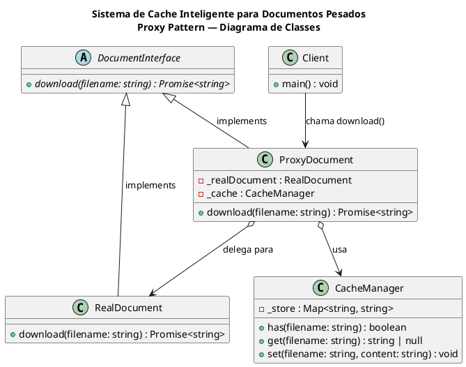

# Documentação de Arquitetura
## Sistema de Cache Inteligente para Documentos Pesados
### Proxy Pattern — Entregas do Arquiteto de Sistemas

---

> **Projeto:** Atividade Avaliativa EAD — Entrega 02 — Projeto Geral  
> **Disciplina:** Engenharia de Software / Padrões de Projeto  
> **Instituição:** UFR — Universidade Federal de Rondonópolis  
> **Papel:** Arquiteto de Sistemas  
> **Data:** Maio de 2026  

---

## Sumário

1. [Visão Geral da Arquitetura](#1-visão-geral-da-arquitetura)
2. [Padrão Aplicado — Proxy Pattern](#2-padrão-aplicado--proxy-pattern)
3. [Estrutura de Classes](#3-estrutura-de-classes)
4. [Diagrama de Classes](#4-diagrama-de-classes)
5. [Diagrama de Sequência](#5-diagrama-de-sequência)
6. [Organização do Código-Fonte](#6-organização-do-código-fonte)
7. [Padronização — ES Modules](#7-padronização--es-modules)
8. [Contratos de Interface (Esqueletos)](#8-contratos-de-interface-esqueletos)
9. [Fluxo de Execução](#9-fluxo-de-execução)
10. [Requisitos Atendidos](#10-requisitos-atendidos)
11. [Decisões Arquiteturais](#11-decisões-arquiteturais)

---

## 1. Visão Geral da Arquitetura

O sistema implementa o **Proxy Pattern** (Padrão Estrutural) para otimizar o carregamento de documentos pesados via cache em memória.

A arquitetura segue o princípio de **separação de responsabilidades**: cada classe possui uma única função bem definida, e o cliente nunca interage diretamente com o objeto real — sempre passa pelo Proxy.

```
Cliente
  │
  ▼
ProxyDocument  ──────► CacheManager (Map em memória)
  │
  ▼ (somente em Cache MISS)
RealDocument
  │
  ▼
Servidor / Internet
```

**Benefício central:** em requisições repetidas, o `RealDocument` e o servidor remoto **não são acionados**, eliminando latência e consumo de banda.

---

## 2. Padrão Aplicado — Proxy Pattern

### O que é o Proxy Pattern?

O Proxy Pattern é um padrão estrutural (GoF) que fornece um **substituto ou representante** de outro objeto para controlar o acesso a ele. O cliente não sabe se está falando com o objeto real ou com o Proxy — ambos implementam a mesma interface.

### Por que foi escolhido?

| Critério | Justificativa |
|---|---|
| Complexidade de implementação | Baixa — requer apenas 3 classes principais |
| Clareza do benefício | Alta — cache é visível e mensurável |
| Divisão de tarefas | Natural — 1 interface, 1 real, 1 proxy, 1 cache |
| Adequação ao contexto acadêmico | Alta — demonstra claramente conceitos de OO e Engenharia de Software |

### Variante utilizada

**Cache Proxy** — variante onde o Proxy armazena resultados de operações custosas e os retorna em chamadas subsequentes, evitando reprocessamento.

---

## 3. Estrutura de Classes

O sistema é composto por **4 classes** e **1 interface abstrata**:

### DocumentInterface
```
«interface»
DocumentInterface
─────────────────────────────────
+ download(filename: string) : Promise<string>  {abstract}
```
- Define o **contrato** que tanto `RealDocument` quanto `ProxyDocument` devem respeitar.
- Garante que o cliente possa trabalhar com qualquer implementação de forma transparente.
- Em JavaScript, é simulada via classe abstrata com `throw new Error()`.

---

### RealDocument
```
RealDocument
implements DocumentInterface
─────────────────────────────────
+ download(filename: string) : Promise<string>
```
- Responsável pelo **carregamento real** do documento.
- Simula uma requisição de rede com delay de 2.5 segundos.
- É acionado **somente** quando o documento não está em cache.

---

### ProxyDocument
```
ProxyDocument
implements DocumentInterface
─────────────────────────────────
- _realDocument : RealDocument
- _cache        : CacheManager
─────────────────────────────────
+ download(filename: string) : Promise<string>
```
- **Ponto central da arquitetura.** É o único objeto com o qual o cliente interage.
- Intercepta a requisição, consulta o cache e decide se aciona o `RealDocument`.
- Mantém referências privadas para `RealDocument` e `CacheManager`.

---

### CacheManager
```
CacheManager
─────────────────────────────────
- _store : Map<string, string>
─────────────────────────────────
+ has(filename: string)            : boolean
+ get(filename: string)            : string | null
+ set(filename, content: string)   : void
```
- Gerencia o armazenamento em memória usando `Map` nativo do JavaScript.
- Expõe três operações simples: verificar existência, recuperar e armazenar.
- Isolada do `ProxyDocument` para permitir evolução independente (ex: futuramente persistir em disco ou Redis).

---

### Client (app.js)
```
Client
─────────────────────────────────
+ main() : void
```
- Ponto de entrada da aplicação.
- Instancia o `ProxyDocument` e realiza chamadas de download.
- Demonstra os dois cenários: **Cache MISS** (primeira requisição) e **Cache HIT** (requisição repetida).

---

## 4. Diagrama de Classes

> Arquivo: `diagrama-classes.png` | Fonte PlantUML: `diagrama-classes.puml`

O diagrama representa as cinco entidades do sistema e seus relacionamentos:

| Relacionamento | Tipo | Descrição |
|---|---|---|
| `RealDocument` → `DocumentInterface` | Realização (implements) | Implementa o contrato da interface |
| `ProxyDocument` → `DocumentInterface` | Realização (implements) | Implementa o contrato da interface |
| `ProxyDocument` → `RealDocument` | Associação (usa) | Delega o download quando cache miss |
| `ProxyDocument` → `CacheManager` | Associação (usa) | Consulta e atualiza o cache |
| `Client` → `ProxyDocument` | Dependência (chama) | Único ponto de entrada do cliente |

### Fonte PlantUML — `diagrama-classes.puml`



---

## 5. Diagrama de Sequência

> Arquivo: `diagrama-sequencia.png` | Fonte PlantUML: `diagrama-sequencia.puml`

O diagrama cobre dois cenários de execução:

### Cenário 1 — Cache MISS (Primeira Requisição)

```
Cliente           ProxyDocument     CacheManager      RealDocument      Servidor
  │                    │                 │                  │               │
  │─download(f)───────►│                 │                  │               │
  │                    │─has(f)─────────►│                  │               │
  │                    │◄────────────────│ false            │               │
  │                    │─download(f)────────────────────────►               │
  │                    │                 │                  │─HTTP Req──────►│
  │                    │                 │                  │◄──────────────│ conteúdo
  │                    │◄────────────────────────────────── │ conteúdo      │
  │                    │─set(f, conteúdo)►│                  │               │
  │                    │◄────────────────│ armazenado        │               │
  │◄───────────────────│ conteúdo [Servidor]                │               │
```

**Etapas:**
1. Cliente chama `download("relatorio.pdf")` no Proxy.
2. Proxy consulta o cache → **não encontrado** (`false`).
3. Proxy delega para `RealDocument.download()`.
4. `RealDocument` faz a requisição ao servidor e aguarda (simula 2.5s).
5. Conteúdo retorna ao Proxy.
6. Proxy armazena no `CacheManager`.
7. Proxy retorna o conteúdo ao cliente com indicação de origem: **Servidor**.

---

### Cenário 2 — Cache HIT (Requisição Repetida)

```
Cliente           ProxyDocument     CacheManager      RealDocument      Servidor
  │                    │                 │                  │               │
  │─download(f)───────►│                 │                  │               │
  │                    │─has(f)─────────►│                  │               │
  │                    │◄────────────────│ true ✓           │               │
  │                    │─get(f)─────────►│                  │               │
  │                    │◄────────────────│ conteúdo em cache│               │
  │◄───────────────────│ conteúdo [Cache]│                  │               │
```

**Etapas:**
1. Cliente chama `download("relatorio.pdf")` novamente.
2. Proxy consulta o cache → **encontrado** (`true`).
3. Proxy recupera o conteúdo do `CacheManager`.
4. Proxy retorna imediatamente com indicação de origem: **Cache**.
5. `RealDocument` e `Servidor` **não são acionados**.

**Ganho de performance:** eliminação total do delay de 2.5s nas requisições subsequentes.

---

## 6. Organização do Código-Fonte

Estrutura de diretórios definida pelo Arquiteto:

```
projeto-proxy/
│
├── src/
│   ├── interfaces/
│   │   └── DocumentInterface.js    → Contrato/Interface abstrata
│   │
│   ├── real/
│   │   └── RealDocument.js         → Implementação real (simula servidor)
│   │
│   ├── proxy/
│   │   └── ProxyDocument.js        → Proxy com lógica de cache
│   │
│   ├── cache/
│   │   └── CacheManager.js         → Gerenciador de cache em memória
│   │
│   └── app.js                      → Ponto de entrada da aplicação
│
├── docs/
│   ├── diagrama-classes.puml       → Diagrama de Classes (PlantUML)
│   ├── diagrama-classes.png        → Diagrama de Classes (imagem)
│   ├── diagrama-sequencia.puml     → Diagrama de Sequência (PlantUML)
│   ├── diagrama-sequencia.png      → Diagrama de Sequência (imagem)
│   └── ARQUITETURA.md              → Este documento
│
├── README.md
├── .gitignore
└── package.json
```

**Princípio de organização:** cada diretório em `src/` corresponde a um papel arquitetural distinto do Proxy Pattern. Isso facilita a localização de código, a divisão de tarefas entre os membros e a manutenção futura.

---

## 7. Padronização — ES Modules

### Problema identificado

O repositório original apresentava **inconsistência de módulos**:

| Arquivo | Padrão usado | Status |
|---|---|---|
| `DocumentInterface.js` | ES Modules (`import/export`) | ✅ Correto |
| `RealDocument.js` | ES Modules (`import/export`) | ✅ Correto |
| `app.js` | CommonJS (`module.exports`) | ❌ Inconsistente |
| `package.json` | Ausência de `"type"` | ❌ Incompleto |

Sem a declaração `"type": "module"` no `package.json`, o Node.js interpreta todos os arquivos `.js` como CommonJS por padrão, causando erro ao encontrar `import/export`.

### Correção aplicada

**`package.json`** — adicionado `"type": "module"`:
```json
{
  "name": "projeto-proxy",
  "version": "1.0.0",
  "type": "module",
  "main": "src/app.js",
  "scripts": {
    "start": "node src/app.js"
  }
}
```

**`app.js`** — reescrito com ES Modules e fluxo de demonstração completo:
```javascript
import { ProxyDocument } from './proxy/ProxyDocument.js';

async function main() {
  const proxy = new ProxyDocument();

  // Cenário 1: Cache MISS — acionará RealDocument
  const doc1 = await proxy.download('relatorio-anual.pdf');

  // Cenário 2: Cache HIT — retorna do cache
  const doc2 = await proxy.download('relatorio-anual.pdf');

  // Cenário 3: Novo arquivo — Cache MISS novamente
  const doc3 = await proxy.download('manual-tecnico.pdf');
}

main();
```

> **Importante:** todos os imports em ES Modules exigem a extensão `.js` explícita (ex: `'./proxy/ProxyDocument.js'`). O Node.js não resolve automaticamente a extensão nesse modo.

---

## 8. Contratos de Interface (Esqueletos)

O Arquiteto define os **contratos** das classes que serão implementadas pelo Desenvolvedor Backend. Os esqueletos garantem que a estrutura arquitetural seja respeitada mesmo antes da implementação.

### ProxyDocument.js

```javascript
// src/proxy/ProxyDocument.js
import { DocumentInterface } from '../interfaces/DocumentInterface.js';
import { RealDocument }      from '../real/RealDocument.js';
import { CacheManager }      from '../cache/CacheManager.js';

export class ProxyDocument extends DocumentInterface {
    constructor() {
        super();
        this._realDocument = new RealDocument();
        this._cache = new CacheManager();
    }

    /**
     * Intercepta a requisição de download.
     * 1. Verifica cache → retorna se existir (Cache HIT).
     * 2. Delega ao RealDocument → armazena em cache → retorna (Cache MISS).
     * @param {string} filename
     * @returns {Promise<string>}
     */
    async download(filename) {
        throw new Error("Método 'download()' deve ser implementado.");
    }
}
```

**O que o Dev deve implementar em `download()`:**
1. Chamar `this._cache.has(filename)`.
2. Se `true` → chamar `this._cache.get(filename)` e retornar.
3. Se `false` → chamar `this._realDocument.download(filename)`, armazenar via `this._cache.set()` e retornar.

---

### CacheManager.js

```javascript
// src/cache/CacheManager.js
export class CacheManager {
    constructor() {
        this._store = new Map();
    }

    has(filename) {
        throw new Error("Método 'has()' deve ser implementado.");
    }

    get(filename) {
        throw new Error("Método 'get()' deve ser implementado.");
    }

    set(filename, content) {
        throw new Error("Método 'set()' deve ser implementado.");
    }
}
```

**O que o Dev deve implementar:**
- `has()` → `return this._store.has(filename)`
- `get()` → `return this._store.get(filename) ?? null`
- `set()` → `this._store.set(filename, content)`

> Os `throw new Error()` são intencionais: forçam o Dev a implementar explicitamente cada método, evitando falhas silenciosas durante os testes do QA.

---

## 9. Fluxo de Execução

Fluxo completo de uma execução do sistema com `npm start`:

```
1. Node.js carrega app.js
2. ProxyDocument é instanciado
   └── RealDocument é instanciado internamente
   └── CacheManager é instanciado internamente (Map vazio)

3. proxy.download("relatorio-anual.pdf")          ← Chamada 1
   ├── ProxyDocument.download() executado
   ├── CacheManager.has() → false
   ├── RealDocument.download() → aguarda 2.5s → retorna conteúdo
   ├── CacheManager.set() → armazena
   └── Retorna conteúdo [origem: Servidor]

4. proxy.download("relatorio-anual.pdf")          ← Chamada 2
   ├── ProxyDocument.download() executado
   ├── CacheManager.has() → true
   ├── CacheManager.get() → retorna conteúdo imediatamente
   └── Retorna conteúdo [origem: Cache]

5. proxy.download("manual-tecnico.pdf")           ← Chamada 3
   ├── ProxyDocument.download() executado
   ├── CacheManager.has() → false (novo arquivo)
   ├── RealDocument.download() → aguarda 2.5s → retorna conteúdo
   ├── CacheManager.set() → armazena
   └── Retorna conteúdo [origem: Servidor]
```

---

## 10. Requisitos Atendidos

| Código | Requisito | Classe Responsável | Status |
|---|---|---|---|
| RF01 | Solicitar documentos | `Client` (app.js) | ✅ Implementado |
| RF02 | Verificar cache | `ProxyDocument` + `CacheManager` | ✅ Estrutura definida |
| RF03 | Realizar download | `RealDocument` | ✅ Implementado |
| RF04 | Armazenar cache | `CacheManager` | ✅ Estrutura definida |
| RF05 | Informar origem do arquivo | `ProxyDocument` | ✅ Previsto no contrato |

---

## 11. Decisões Arquiteturais

### Por que `Map` e não array ou objeto literal?

`Map` oferece complexidade `O(1)` para `has()` e `get()`, chaves do tipo `string` sem colisões com propriedades herdadas do protótipo, e API semântica clara (`has`, `get`, `set`).

### Por que `CacheManager` é uma classe separada e não está dentro do Proxy?

Separar o cache em classe própria respeita o **Single Responsibility Principle**. Futuramente, é possível trocar a implementação (ex: adicionar TTL, LRU, persistência em arquivo) sem tocar no `ProxyDocument`.

### Por que ES Modules e não CommonJS?

ES Modules é o padrão moderno do JavaScript, suportado nativamente pelo Node.js (v12+). CommonJS é legado. Como o projeto não possui dependências que exijam CJS, a padronização para ESM é a escolha correta tecnicamente e didaticamente.

### Por que `throw new Error()` nos esqueletos?

Garante **falha explícita e imediata** caso o Dev esqueça de implementar algum método. Sem isso, métodos não implementados retornariam `undefined` silenciosamente, dificultando a depuração durante os testes do QA.

---

*Documento elaborado por Carlos Amarijo UFR — 2026*
